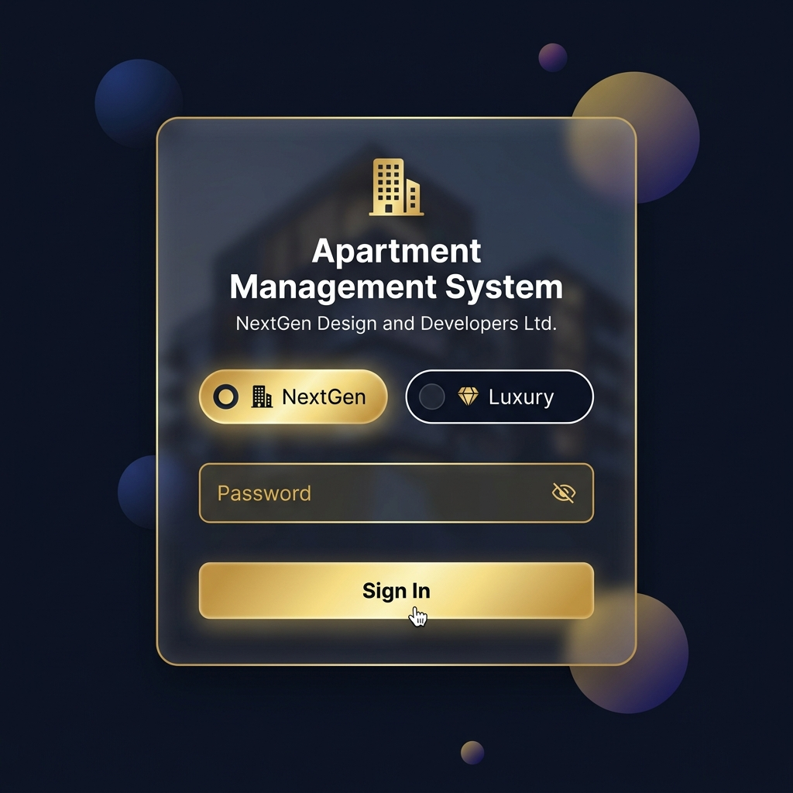
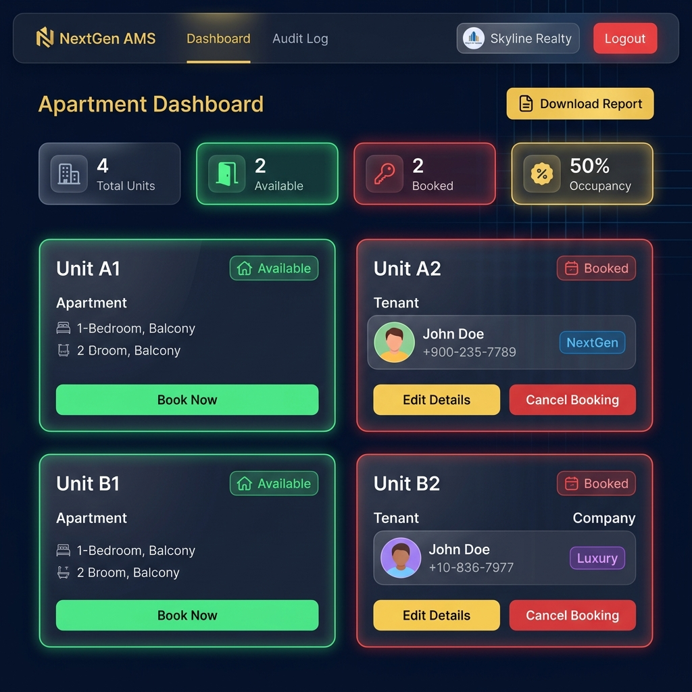
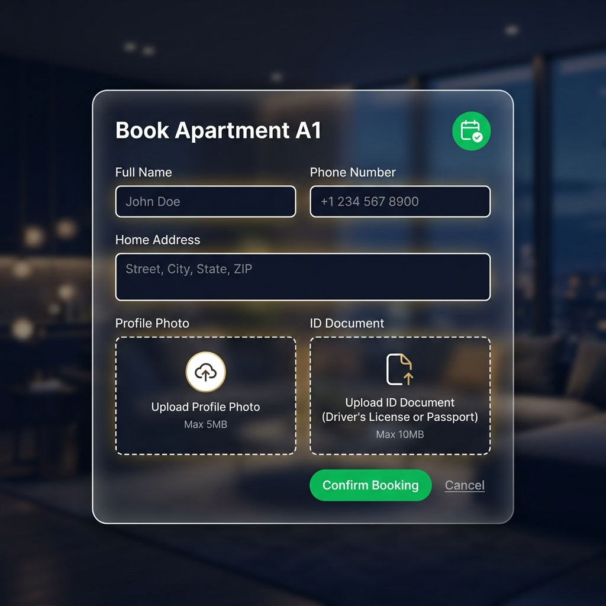
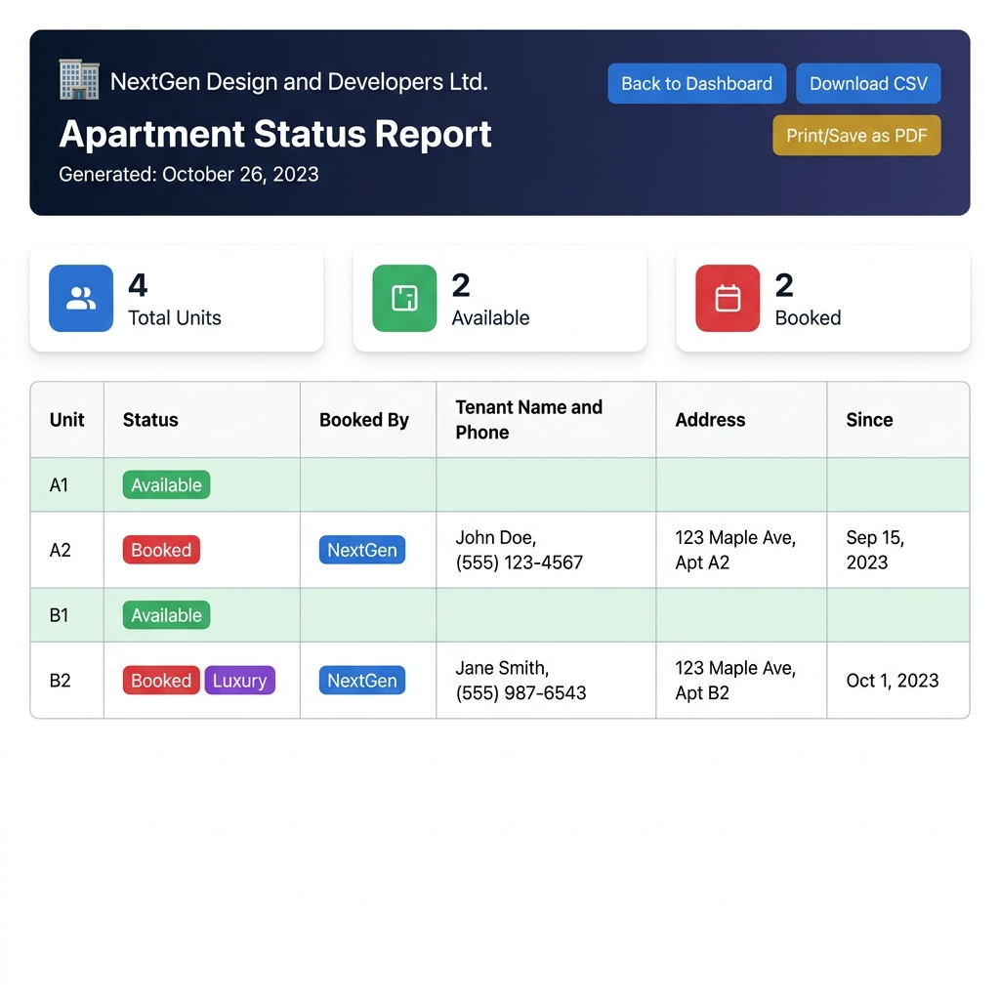
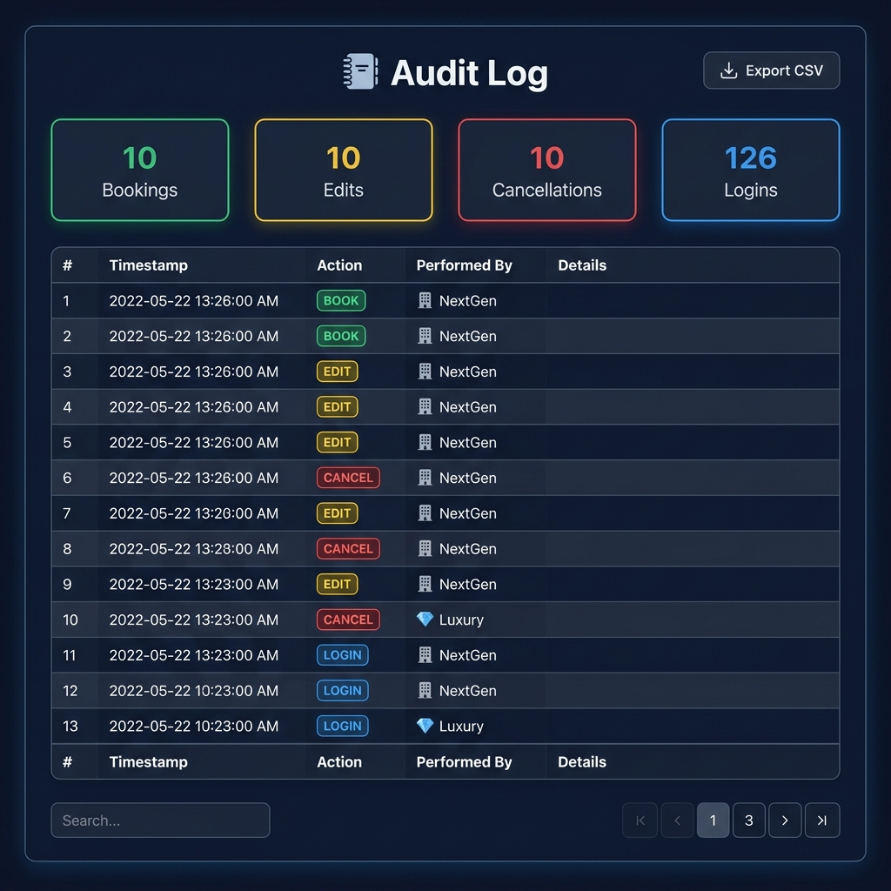

# 🏢 Apartment Management System

<div align="center">


**A production-ready, full-stack Apartment Management System built for**  
**NextGen Design and Developers Ltd. & Luxury Construction**

[🚀 Features](#-features) • [📸 Screenshots](#-screenshots) • [⚙️ Installation](#️-installation) • [🔐 Usage](#-usage) • [📁 Project Structure](#-project-structure) • [🛠️ Tech Stack](#️-tech-stack)

</div>

---

## 📸 Screenshots

### 🔐 Login Page
> Secure role-based login for NextGen and Luxury Construction operators



---

### 🏠 Dashboard
> Real-time apartment grid with color-coded status cards, stats, and contextual action buttons



---

### 📋 Booking Modal
> Elegant booking form with profile photo upload, document upload, and drag-and-drop support



---

### 📊 Apartment Status Report
> Printable PDF-ready report with summary cards and a full apartment listing table



---

### 🗒️ Audit Log
> Full system event history with color-coded action badges, search, and CSV export



---

## 🚀 Features

### 🏘️ Apartment Management
- **4 apartment units**: A1, A2, B1, B2 — pre-seeded on first run
- **Real-time status grid** — color-coded cards (🟢 Green = Available, 🔴 Red = Booked)
- **Live occupancy stats** — Total, Available, Booked, Occupancy % updated every 30 seconds
- **Anti-double-booking** — server-side validation prevents concurrent booking of the same unit

### 👥 Role-Based Access Control (RBAC)
| Feature | NextGen | Luxury |
|---|:---:|:---:|
| View dashboard | ✅ | ✅ |
| Book available apartments | ✅ | ✅ |
| Edit **own** bookings | ✅ | ✅ |
| Cancel **own** bookings | ✅ | ✅ |
| Edit other company's booking | ❌ | ❌ |
| View tenant profile | ✅ | ✅ |
| View audit log | ✅ | ✅ |
| Download reports | ✅ | ✅ |

### 📦 Booking Features
- Book apartments with: **Full Name, Phone, Address, Profile Photo, ID Document**
- **Edit Details** — update any customer info on a booking your company made
- **Cancel Booking** — confirmation dialog before permanently removing a booking
- **View Profile** — AJAX-powered modal showing tenant photo, contact, and document download
- File uploads: images (PNG/JPG/WEBP) and documents (PDF/DOC/DOCX)

### 📤 Telegram DB Backup
- Automatically sends the `apartments.db` file to your configured Telegram Bot/Channel
- Triggers after every **BOOK**, **EDIT**, and **CANCEL** operation
- Runs in a **background daemon thread** — never blocks the HTTP response
- Includes **retry logic** (3 attempts with exponential backoff)
- Silently skips if credentials are not configured

### 📊 Reports
- **View/Print Report** — opens a styled, print-optimized HTML page → Save as PDF via browser
- **Download CSV** — instant `.csv` download with all apartment data
- Report includes: Unit, Status, Booked By (Company), Tenant Name & Phone, Address, Booking Date

### 🗒️ Audit Log
- Every action is logged: LOGIN, LOGOUT, BOOK, EDIT, CANCEL
- Color-coded action badges (green/yellow/red/blue)
- Searchable & sortable via **DataTables.js**
- **Export to CSV** button
- Shows timestamp, action, operator company, and detail notes

### 🎨 Premium UI/UX
- **Glassmorphism** design with frosted-glass cards
- **Deep navy + gold** premium color palette
- Smooth hover animations and card lift effects
- Animated background orbs
- Responsive layout (mobile-friendly)
- Custom modal system (no Bootstrap Modal JS — no backdrop stacking bugs)
- Toast notifications for all actions
- Drag-and-drop file uploads with live preview

---

## ⚙️ Installation

### Prerequisites
- Python 3.10 or higher
- pip
- Git

### Step 1 — Clone the Repository
```bash
git clone https://github.com/pythonicshariful/Apartment-Management-System.git
cd Apartment-Management-System
```

### Step 2 — Install Dependencies
```bash
pip install -r requirements.txt
```

### Step 3 — Configure Environment Variables
Create a `.env` file in the root directory (or rename/copy the template):

```env
FLASK_SECRET_KEY=your_strong_secret_key_here
TELEGRAM_BOT_TOKEN=your_telegram_bot_token
TELEGRAM_CHAT_ID=your_telegram_channel_chat_id
NEXTGEN_PASSWORD=your_nextgen_password
LUXURY_PASSWORD=your_luxury_password
```

> **How to get a Telegram Bot Token:**
> 1. Open Telegram → search **@BotFather**
> 2. Send `/newbot` and follow the steps
> 3. Copy the token provided
> 4. Add your bot to a channel/group as admin
> 5. Get the Chat ID from `https://api.telegram.org/bot<TOKEN>/getUpdates`

### Step 4 — Initialize the Database
```bash
python -c "from database import init_db; init_db()"
```

### Step 5 — Run the Application
```bash
python app.py
```

Open your browser and navigate to: **http://127.0.0.1:5000**

---

## 🔐 Usage

### Default Login Credentials

| Company | Role | Password |
|---|---|---|
| 🏢 NextGen Design and Developers Ltd. | Operator | *(set in `.env` → `NEXTGEN_PASSWORD`)* |
| 💎 Luxury Construction | Operator | *(set in `.env` → `LUXURY_PASSWORD`)* |

> ⚠️ **Never share your `.env` file.** Set strong passwords before running the application.

### Booking Workflow

```
1. Login as NextGen or Luxury
       ↓
2. Dashboard shows all 4 apartments
       ↓
3. Click "Book Now" on an Available apartment
       ↓
4. Fill tenant name, phone, address + upload photo/document
       ↓
5. Click "Confirm Booking"
       ↓
6. Apartment turns RED (Booked) — Telegram receives DB backup
       ↓
7. Click "View Profile" to see tenant details
       ↓
8. Click "Edit Details" to update info (only your company's booking)
       ↓
9. Click "Cancel Booking" → confirm → apartment turns GREEN (Available)
```

### Downloading Reports

1. Click **"Download Report ▾"** on the dashboard
2. Choose:
   - **View / Print as PDF** → opens report in new tab → `Ctrl+P` → Save as PDF
   - **Download CSV** → instantly downloads a `.csv` file

---

## 📁 Project Structure

```
Apartment-Management-System/
│
├── app.py                    # 🚀 Main Flask application — routes, RBAC, file uploads
├── database.py               # 🗄️ SQLite schema, CRUD operations, audit logging
├── telegram_backup.py        # 📤 Async Telegram DB backup (background thread)
│
├── .env                      # 🔑 Secrets & credentials (NOT committed to Git)
├── requirements.txt          # 📦 Python dependencies
├── README.md                 # 📖 This file
│
├── apartments.db             # 🗄️ SQLite database (auto-created, NOT in Git)
│
├── static/
│   ├── css/
│   │   └── style.css         # 🎨 Premium dark theme — glassmorphism, animations
│   ├── js/
│   │   └── main.js           # ⚡ Custom modal system, AJAX, file previews
│   └── uploads/              # 📁 Uploaded profile pics & documents (NOT in Git)
│       ├── profiles/
│       └── documents/
│
├── templates/
│   ├── base.html             # 🏗️ Base layout — navbar, toasts, footer
│   ├── login.html            # 🔐 Login page with role selector
│   ├── dashboard.html        # 🏠 Main apartment grid & stats
│   ├── audit_log.html        # 🗒️ Audit log with DataTables
│   ├── report.html           # 📊 Printable apartment status report
│   ├── 404.html              # ❌ 404 error page
│   └── partials/
│       ├── apartment_card.html   # 🃏 Individual apartment card
│       ├── booking_modal.html    # 📋 New booking form modal
│       ├── edit_modal.html       # ✏️ Edit booking modal
│       └── profile_modal.html    # 👤 Tenant profile view modal
│
└── screenshots/              # 📸 UI screenshots for README
```

---

## 🛠️ Tech Stack

| Layer | Technology | Purpose |
|---|---|---|
| **Backend** | Flask 3.0.3 | Web framework, routing, sessions |
| **Database** | SQLite 3 | Lightweight relational database |
| **ORM** | Raw `sqlite3` | Direct SQL queries, no ORM overhead |
| **Frontend** | Bootstrap 5.3 | Responsive layout, utilities |
| **Icons** | Bootstrap Icons 1.11 | UI icon set |
| **Typography** | Google Fonts (Inter) | Premium sans-serif typeface |
| **Tables** | DataTables.js | Sortable/searchable audit log table |
| **Backup** | Telegram Bot API | Automatic DB backup via `requests` |
| **Auth** | Flask Sessions | Server-side session management |
| **Uploads** | Werkzeug | Secure filename handling |
| **Config** | python-dotenv | `.env` secret management |
| **Concurrency** | Python `threading` | Non-blocking Telegram backup |

---

## 🗄️ Database Schema

```sql
-- Apartments (4 units: A1, A2, B1, B2)
CREATE TABLE apartments (
    id        TEXT PRIMARY KEY,       -- 'A1', 'A2', 'B1', 'B2'
    status    TEXT NOT NULL,          -- 'Available' | 'Booked'
    booked_by TEXT DEFAULT NULL       -- 'nextgen' | 'luxury' | NULL
);

-- Customer records linked to apartments
CREATE TABLE customers (
    id             INTEGER PRIMARY KEY AUTOINCREMENT,
    apartment_id   TEXT NOT NULL UNIQUE,
    name           TEXT NOT NULL,
    address        TEXT NOT NULL,
    phone          TEXT NOT NULL,
    profile_pic    TEXT DEFAULT NULL,  -- relative path to uploaded image
    document_path  TEXT DEFAULT NULL,  -- relative path to uploaded document
    booked_at      TEXT NOT NULL,      -- booking timestamp
    FOREIGN KEY (apartment_id) REFERENCES apartments(id)
);

-- Full audit trail of all system actions
CREATE TABLE audit_logs (
    id           INTEGER PRIMARY KEY AUTOINCREMENT,
    timestamp    TEXT NOT NULL,
    action       TEXT NOT NULL,        -- 'LOGIN' | 'LOGOUT' | 'BOOK' | 'EDIT' | 'CANCEL'
    performed_by TEXT NOT NULL,        -- 'nextgen' | 'luxury'
    details      TEXT
);
```

---

## 🔒 Security

- **Session-based authentication** with Flask's secure cookie sessions
- **RBAC enforcement** on both server-side routes AND UI (buttons hidden for unauthorized users)
- **`.env` excluded from Git** — credentials never committed
- **`apartments.db` excluded from Git** — database stays local
- **`static/uploads/` excluded from Git** — uploaded files stay local
- **Werkzeug `secure_filename`** — prevents directory traversal on uploads
- **16 MB max upload size** enforced server-side
- **File type allowlists** — only images and documents accepted

---

## 📡 Telegram Backup Setup

1. Create a bot via [@BotFather](https://t.me/botfather) on Telegram
2. Add the bot to your channel/group as an **Admin**
3. Send a message in the channel, then fetch your Chat ID:
   ```
   https://api.telegram.org/bot<YOUR_TOKEN>/getUpdates
   ```
4. Update `.env`:
   ```env
   TELEGRAM_BOT_TOKEN=123456789:ABCdef...
   TELEGRAM_CHAT_ID=-100123456789
   ```
5. Every time you **book**, **edit**, or **cancel** a booking, the bot automatically sends `apartments.db` to your channel with a caption showing the action and operator.

---

## 🚀 Deployment Tips

### Production Server (Gunicorn)
```bash
pip install gunicorn
gunicorn -w 4 -b 0.0.0.0:8000 app:app
```

### With Nginx (recommended)
```nginx
server {
    listen 80;
    server_name yourdomain.com;

    location / {
        proxy_pass http://127.0.0.1:8000;
        proxy_set_header Host $host;
        proxy_set_header X-Real-IP $remote_addr;
    }

    location /static {
        alias /path/to/Apartment-Management-System/static;
    }
}
```

> ⚠️ Set `FLASK_DEBUG=False` in production and use a strong `FLASK_SECRET_KEY`.

---

## 📝 API Endpoints

| Method | Endpoint | Description | Auth Required |
|---|---|---|---|
| GET | `/` | Dashboard | ✅ |
| GET/POST | `/login` | Login page | ❌ |
| GET | `/logout` | Logout | ✅ |
| GET | `/api/apartments` | JSON apartment data | ✅ |
| POST | `/book/<apt_id>` | Book an apartment | ✅ Operator |
| POST | `/edit/<apt_id>` | Edit booking details | ✅ Owner only |
| POST | `/cancel/<apt_id>` | Cancel a booking | ✅ Owner only |
| GET | `/profile/<apt_id>` | Get tenant profile (JSON) | ✅ |
| GET | `/report` | View printable report | ✅ |
| GET | `/report/csv` | Download CSV report | ✅ |
| GET | `/audit` | Audit log page | ✅ |

---

## 🤝 Contributing

Pull requests are welcome! For major changes, please open an issue first.

1. Fork the repository
2. Create your feature branch: `git checkout -b feature/AmazingFeature`
3. Commit your changes: `git commit -m 'Add AmazingFeature'`
4. Push to the branch: `git push origin feature/AmazingFeature`
5. Open a Pull Request

---

## 📄 License

This project is licensed under the **MIT License** — see the [LICENSE](LICENSE) file for details.

---

## 👨‍💻 Developer

<div align="center">

**Shariful Islam**

[](https://github.com/pythonicshariful)
[](https://wa.me/8801560023427)
[](mailto:pythonicshariful@gmail.com)

</div>

---

<div align="center">
  <sub>Built with ❤️ for <strong>NextGen Design and Developers Ltd.</strong> &amp; <strong>Luxury Construction</strong></sub>
</div>
